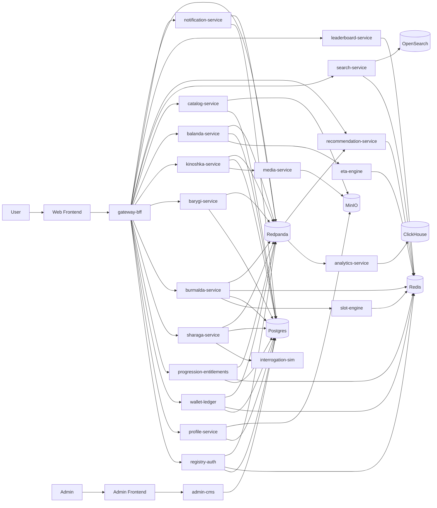
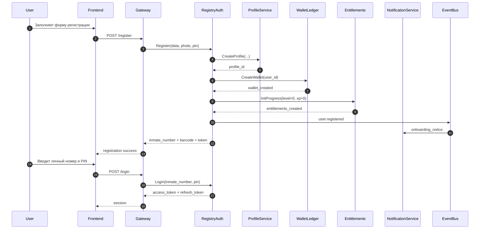
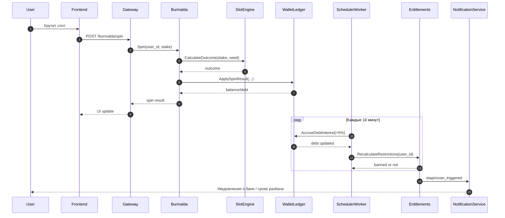

Ниже — уже **переделанная архитектура именно под ваши сервисы и ваши экраны**, а не абстрактная экосистема.

Одна важная оговорка: я **не буду проектировать механику, которая учит реальному мошенничеству**. Поэтому режим с “разводом бабушек” я технически переведу в **сатирический anti-scam / interrogation simulator**: игрок либо распознаёт манипуляции, либо проходит “допрос” и сценарии на психологическую устойчивость. Это сохраняет вайб, но не превращает проект в тренажёр по преступлениям.

---

# 1. Как я бы собрал ZONDEX как цельную платформу

## Продуктовая карта

У вас уже фактически не один сайт, а **super-app с общей экономикой**:

* **ZONDEX.Регистрация** — отдельный входной сервис
* **ZONDEX.Шарага** — основной источник XP и “бабок”
* **ZONDEX.Бурмалда** — казино, которое сжигает “бабки” и создаёт долг
* **ZONDEX.Барыги** — маркетплейс с level-gating
* **ZONDEX.Киношка** — фильмы, подписки, поштучная покупка
* **ZONDEX.Баланда** — доставка еды с unlock-механиками по уровню

## Главный архитектурный принцип

У вас не просто набор экранов. У вас есть **четыре общие платформенные оси**, которые должны жить отдельно от конкретных сервисов:

1. **Identity / Registration**
2. **Economy / Wallet / Debt**
3. **Progression / XP / Unlocks / Bans**
4. **Content / Catalog / Notifications / Analytics**

То есть правильная архитектура — это не “по сервису на каждый экран”, а:

* **вертикальные продуктовые домены** для Шараги, Бурмалды, Барыг, Киношки, Баланды;
* плюс **горизонтальные платформенные сервисы**, которые склеивают всё в одну игру.

Это и будет выглядеть по-взрослому.

---

# 2. Архитектурное решение

## Выбор модели

Я бы делал **hybrid microservices**:

* снаружи — **один Gateway / BFF**
* внутри — **gRPC**
* между сервисами — **Kafka / Redpanda events**
* для быстрых проверок — **Redis**
* для состояния — **Postgres**
* для аналитики — **ClickHouse**
* для файлов и карточек — **MinIO**
* для поиска — **OpenSearch**

## Почему так хорошо ложится именно на ваш проект

Потому что у вас много механик, которые пересекают сервисы:

* бабки зарабатываются в Шараге
* тратятся в Бурмалде, Барыгах, Киношке, Баланде
* уровень открывает фичи сразу в нескольких продуктах
* долг из Бурмалды влияет на глобальный доступ
* бан можно снять через задания в Шараге
* уведомления и лидерборды общие
* рекомендации должны знать, что человек любит: фильмы, слоты, загадки или жрать в доставке

Если делать это как набор независимых сайтов, всё развалится. Если делать как один монолит, будет тяжело красиво разнести на генерацию кода. Поэтому **средний путь** — лучший.

---

# 3. Главная техническая идея: один сервис unlock-логики

Ваши смешные механики типа:

* поиск сначала недоступен,
* фильтры сначала заблокированы,
* корзина на нулевом уровне = 0,
* кнопка “в корзину” маленькая на низком уровне,
* в доставке сначала нет выбора времени,
* способы доставки открываются по уровням,
* бан по долгу,
* досрочное снятие бана через задания,

не надо размазывать по 5 продуктам вручную.

Нужен отдельный сервис:

## `progression-entitlements`

Он считает и отдаёт снапшот прав пользователя:

```json
{
  "level": 2,
  "xp": 340,
  "wallet_balance": 480,
  "debt_balance": -1700,
  "search_enabled": false,
  "filters_enabled": false,
  "cart_limit": 1,
  "delivery_modes": ["as_is"],
  "precise_eta_enabled": false,
  "menu_choice_count": 2,
  "daily_spin_available": true,
  "banned_until": null,
  "can_early_unban_via_tasks": true,
  "film_subscription_tier": "pervohod"
}
```

Это очень сильное решение.

### Почему

Потому что фронт и бэкенд всегда смотрят **в одно место**:

* что пользователю можно,
* что ему нельзя,
* какой у него уровень,
* какие фичи открыты.

---

# 4. Сервисная карта

## Платформенные сервисы

| Сервис                     | Назначение                                                    |   Язык | Хранилище         |
| -------------------------- | ------------------------------------------------------------- | -----: | ----------------- |
| `gateway-bff`              | единая внешняя REST-точка, агрегация данных для фронта        |     Go | Redis             |
| `registry-auth`            | регистрация, вход по личному номеру и PIN, JWT                |     Go | Postgres, Redis   |
| `profile-service`          | профиль заключённого, фото, кличка, статья, камера, срок      |     Go | Postgres, MinIO   |
| `wallet-ledger`            | бабки, списания, начисления, долг, append-only ledger         |     Go | Postgres, Redis   |
| `progression-entitlements` | XP, уровни, unlocks, bans, ограничения UI и API               |     Go | Postgres, Redis   |
| `notification-service`     | push/in-app/system notices                                    | Python | Redis, Postgres   |
| `leaderboard-service`      | авторитет, топы недели, должники                              |     Go | Redis, Postgres   |
| `catalog-service`          | единый каталог товаров, фильмов, игр, челленджей              |     Go | Postgres          |
| `search-service`           | поиск по каталогу и рекомендациям                             | Python | OpenSearch, Redis |
| `recommendation-service`   | персональная лента и сервисные подсказки                      | Python | Redis, ClickHouse |
| `analytics-ingest`         | приём событий клиента и бэкенда                               |     Go | Kafka             |
| `analytics-service`        | агрегации, дешборды, метрики                                  | Python | ClickHouse        |
| `admin-cms`                | ручное управление контентом, баллами, банами, заданиями       |     Go | Postgres          |
| `scheduler-worker`         | проценты по долгу, daily spin, daily challenge, таймеры банов |     Go | Postgres, Kafka   |

## Продуктовые сервисы

| Сервис              | Назначение                                               |   Язык | Хранилище       |
| ------------------- | -------------------------------------------------------- | -----: | --------------- |
| `sharaga-service`   | мини-игры, вопросы, сценарии, выдача XP и бабок          |     Go | Postgres        |
| `interrogation-sim` | AI-сценарии: допрос, anti-scam, psychological prompts    | Python | Postgres        |
| `burmalda-service`  | казино, кредит, спин, долг, статус этапирования          |     Go | Postgres, Redis |
| `slot-engine`       | расчёт выпадений, таблицы выплат, RNG-механика           |    C++ | Redis           |
| `barygi-service`    | маркетплейс, корзина, блокировки, “стукнуть” на продавца |     Go | Postgres        |
| `kinoshka-service`  | каталог фильмов, тарифы, покупки, доступ                 |     Go | Postgres        |
| `media-service`     | постеры, трейлеры, streaming asset metadata              |     Go | Postgres, MinIO |
| `balanda-service`   | меню, заказы, способы доставки, подогреть другого        |     Go | Postgres        |
| `eta-engine`        | расчёт времени доставки, окошек, unlock-моделей ETA      |    C++ | Redis           |

---

# 5. Какие сервисы за что реально отвечают

## 5.1 Регистрация и вход

Это отдельный нормальный контур, не вшитый в фронт.

### Что хранится при регистрации

* фото анфас
* погоняло
* статья
* срок
* номер камеры
* PIN-код
* факт принятия “обязательства о соблюдении порядка”
* сгенерированный **личный номер**
* сгенерированный **штрихкод / barcode asset**

### Как это реализовать

`registry-auth`:

* принимает форму,
* валидирует PIN,
* создаёт `inmate_id`,
* хэширует PIN,
* создаёт auth identity,
* вызывает `profile-service`,
* вызывает barcode generator module,
* создаёт стартовый кошелёк в `wallet-ledger`,
* создаёт стартовую запись прогрессии в `progression-entitlements`,
* эмитит `UserRegistered`.

### Вход

По:

* личному номеру
* PIN

`registry-auth` выдаёт:

* access token
* refresh token
* user summary

---

## 5.2 Шарага

Это **главный engine прогрессии**.

### Внутри Шараги я бы оставил 3 режима

1. **Понятия**

   * квиз
   * фиксированные вопросы
   * самая низкая награда

2. **Ситуации / загадки**

   * сценарии с вариантами
   * средняя награда

3. **Допрос / anti-scam simulator**

   * AI-диалог
   * highest reward
   * но как сатирический режим на распознавание манипуляций, а не тренажёр по выманиванию денег

### Что происходит после прохождения

`sharaga-service`:

* считает результат
* вызывает `progression-entitlements` -> начислить XP
* вызывает `wallet-ledger` -> начислить бабки
* вызывает `leaderboard-service` -> обновить авторитет
* шлёт события в Kafka

---

## 5.3 Бурмалда

### Механика

* спин
* ставка
* выигрыш/проигрыш
* если баланс 0 — можно взять кредит
* долг растёт каждые 10 минут на 5%
* при достижении -5000 ставится `etapirovan_until = now + 12h`

### Как это делать правильно

Сама доменная логика — в `burmalda-service`.

Математику выпадения и таблицы выплат лучше вынести в **C++ `slot-engine`**:

* это даёт мемный overengineering,
* и позволяет красиво сказать, что казино-ядро high-performance.

`burmalda-service` отвечает за:

* ставки
* создание debt record
* запрос к `slot-engine`
* запись результата в `wallet-ledger`
* вызов `progression-entitlements` для бан-состояний
* уведомления
* лидерборд должников

### Кто тикает проценты

Не казино.
Проценты должен тикать `scheduler-worker`, чтобы:

* не держать логику в runtime казино,
* не ломать расчёт после рестарта,
* можно было безопасно пересчитать долг.

---

## 5.4 Барыги

Это не просто каталог. Это продукт, завязанный на unlock-экономику.

### Ключевые механики

* поиск сначала выключен
* фильтры поэтапно открываются
* корзина лимитирована уровнем
* кнопка добавления в корзину может меняться по уровню на фронте
* часть товаров недоступна: “запрещено прокурором”
* жалоба заменена на “стукнуть”

### Как реализовать

`barygi-service` не должен сам знать все правила прогрессии.
Он каждый раз смотрит в `progression-entitlements`:

* search_enabled?
* filters_enabled?
* cart_limit?
* can_buy_restricted_goods?
* level_tag?

### Для UX

фронт запрашивает `entitlements snapshot`, а backend повторно валидирует его серверно.

---

## 5.5 Киношка

### Механика

* один бесплатный фильм
* остальное — поштучно или по подписке
* тарифы: Первоход / Пацан / Смотрящий
* доступ к части каталога зависит от тарифа
* единая экономика с бабками

### Технически

`kinoshka-service`:

* управляет карточками фильмов
* знает тарифы
* знает entitlements по подписке
* проверяет доступ к контенту
* запрашивает `wallet-ledger` для pay-per-view
* запрашивает `media-service` для playback metadata

---

## 5.6 Баланда

Это сервис доставки, и у него самые смешные level-based unlocks.

### Механика

* на 0 уровне — одна кнопка “получить”
* позже — выбор из 2, 5, полного меню
* точное время сначала недоступно
* способы доставки открываются по уровням
* “подогреть другого” открывается позже
* можно добавить записку только с определённого уровня

### Техническое решение

`balanda-service` отвечает за:

* меню
* заказы
* разрешённые опции
* флоу “подарить/подогреть”

`eta-engine` на C++:

* считает ETA
* окно доставки
* доступные delivery modes
* special route “экспресс-подкоп” как отдельный флаг

---

# 6. Сквозные сценарии

## Сценарий 1. Регистрация

1. Front -> `gateway-bff`
2. `gateway-bff` -> `registry-auth`
3. `registry-auth`:

   * создаёт identity
   * хэширует PIN
   * генерирует inmate number
4. `registry-auth` -> `profile-service`
5. `profile-service` сохраняет фото в MinIO
6. `registry-auth` генерирует barcode asset
7. `registry-auth` -> `wallet-ledger` создать стартовый баланс
8. `registry-auth` -> `progression-entitlements` создать уровень 0
9. `registry-auth` -> Kafka `user.registered`
10. `notification-service` отправляет onboarding notice

## Сценарий 2. Пользователь прошёл игру в Шараге

1. Front -> `gateway-bff`
2. `gateway-bff` -> `sharaga-service`
3. Если режим AI — `sharaga-service` -> `interrogation-sim`
4. `sharaga-service` считает результат
5. `sharaga-service` -> `progression-entitlements` начислить XP
6. `sharaga-service` -> `wallet-ledger` начислить бабки
7. `sharaga-service` -> `leaderboard-service`
8. События уходят в Kafka -> analytics -> recommendation

## Сценарий 3. Пользователь уходит в долг в Бурмалде

1. Front -> `gateway-bff`
2. `gateway-bff` -> `burmalda-service`
3. `burmalda-service` -> `slot-engine`
4. Результат -> `wallet-ledger`
5. Если баланс < 0, создаётся debt state
6. `scheduler-worker` каждые 10 минут капитализирует +5%
7. При пороге -5000 -> `progression-entitlements` ставит бан до времени X
8. `notification-service` шлёт “ЭТАПИРОВАН”
9. Пользователь может сократить бан через задания в Шараге

## Сценарий 4. Пользователь заказывает еду

1. Front -> `gateway-bff`
2. `gateway-bff` -> `balanda-service`
3. `balanda-service` -> `progression-entitlements` узнать доступные опции
4. `balanda-service` -> `eta-engine` расчёт ETA
5. `balanda-service` -> `wallet-ledger` списание
6. События заказа -> Kafka
7. `notification-service` шлёт статус

---

# 7. Данные и хранилища

## Postgres

Основная транзакционная база:

* аккаунты
* профили
* уровни
* подписки
* заказы
* долг
* история спинов
* каталог
* задания
* записи уведомлений

## Redis

* быстрый баланс
* entitlements snapshot
* rate limiting
* leaderboard cache
* session hints
* daily spin flag
* временные captcha/challenge tokens

## MinIO

* фото анфас
* barcode image
* постеры фильмов
* карточки товаров
* медиа-файлы и превью

## Kafka / Redpanda

Темы:

* `user.events`
* `auth.events`
* `xp.events`
* `wallet.events`
* `debt.events`
* `catalog.events`
* `order.events`
* `delivery.events`
* `notification.events`
* `analytics.raw`

## ClickHouse

* просмотры экранов
* прохождения заданий
* конверсии по сервисам
* retention
* воронка: Шарага -> Бурмалда -> Барыги/Киношка/Баланда

## OpenSearch

* поиск по товарам
* поиск по фильмам
* поиск по челленджам и карточкам

---

# 8. Технический стек по языкам

## Go

Лучше писать:

* gateway
* registry/auth
* profile
* wallet
* progression
* catalog
* core product APIs
* scheduler

Почему:

* быстро
* хорошо для gRPC
* отлично для инфраструктурного и API-кода

## Python

Лучше писать:

* AI-dialog / interrogation simulator
* recommendation
* search glue logic
* notifications
* analytics jobs

Почему:

* удобно для текстовой логики
* удобно для scoring и ранжирования
* быстро делать странные генеративные фичи

## C++

Лучше писать:

* slot-engine
* eta-engine

Почему:

* это красиво и смешно инженерно
* можно показывать как “ultra-performance ядро”
* даёт тот самый overengineering, который тут уместен

---

# 9. Mermaid: общая схема



---

# 10. Mermaid: регистрация и вход



---

# 11. Mermaid: долг, проценты и этапирование



---

# 12. Как это генерировать через ИИ без хаоса

Предположу, ты имел в виду **Claude Code** и **ChatGPT Codex**.

Официальные материалы OpenAI описывают Codex как coding agent для разработки: он умеет писать код, разбирать чужую кодовую базу, делать review, помогать с дебагом и автоматизировать инженерные задачи; в документации также указано, что Codex входит в ChatGPT Plus, Pro, Business, Edu и Enterprise, и у OpenAI есть отдельные материалы по работе с Codex в IDE. Документация Anthropic описывает Claude Code как agentic coding tool, доступный в терминале, IDE, desktop и браузере; он умеет читать кодовую базу, редактировать файлы, запускать команды и интегрироваться с dev-инструментами. ([OpenAI Developers][1])

## Моя практическая рекомендация

Для хакатона не надо, чтобы **два агента одновременно писали один и тот же сервис**. Лучший режим такой:

* **один агент = writer**
* **второй агент = reviewer / refactorer**
* архитектура и контракты фиксируются отдельно и не меняются на лету

То есть:

* либо Codex пишет, а Claude Code проверяет;
* либо наоборот;
* но не “оба правят одну папку одновременно”.

## Правильный пайплайн

### Шаг 1. Заморозить спецификацию

Сначала фиксируете:

* `docs/architecture.md`
* `docs/domain-model.md`
* `proto/*.proto`
* `api/openapi/gateway.yaml`
* `contracts/events/*.json`

Пока этого нет, любой агент начнёт галлюцинировать структуру.

### Шаг 2. Monorepo

Для вас нужен именно **monorepo**, а не multi-repo.

Почему:

* все proto в одном месте,
* все Dockerfile в одном месте,
* все env-шаблоны в одном месте,
* проще гонять Compose,
* проще давать агенту полный контекст.

## Рекомендуемая структура

```text
zondex/
  docs/
    architecture.md
    domain-model.md
    service-map.md
    prompt-rules.md

  proto/
    registry/
    profile/
    wallet/
    entitlements/
    sharaga/
    burmalda/
    barygi/
    kinoshka/
    balanda/
    leaderboard/
    notification/

  api/
    openapi/
      gateway.yaml
      admin.yaml

  contracts/
    events/

  gateway/
    bff-go/

  services/
    registry-auth-go/
    profile-go/
    wallet-go/
    entitlements-go/
    sharaga-go/
    burmalda-go/
    barygi-go/
    kinoshka-go/
    balanda-go/
    leaderboard-go/
    catalog-go/
    scheduler-go/

    interrogation-sim-py/
    search-py/
    recommendation-py/
    notification-py/
    analytics-py/

    slot-engine-cpp/
    eta-engine-cpp/

  frontend/
    app/
    admin/

  deploy/
    compose/
    k8s/

  observability/
    prometheus/
    grafana/
    loki/
    tempo/

  scripts/
    codegen/
    migrate/
    seed/
    dev/
```

---

# 13. В каком порядке генерировать сервисы

Вот правильный порядок.

## Этап 1. Контракты

Сначала генерируете:

1. proto для platform services
2. proto для product services
3. openapi для gateway
4. event schemas

## Этап 2. Каркас

Потом:

1. gateway
2. registry-auth
3. profile
4. wallet-ledger
5. progression-entitlements

Это фундамент.

## Этап 3. Первый вертикальный сценарий

Потом берёте один полный happy path. Я бы первым делал:

**регистрация -> логин -> Шарага -> начисление XP и бабок**

Потому что это открывает всю экономику.

## Этап 4. Казино

Дальше:

* burmalda-service
* slot-engine
* долг
* бан

## Этап 5. Витрины

Потом:

* Barygi
* Kinoshka
* Balanda

## Этап 6. Meta layer

В конце:

* recommendation
* search
* analytics
* admin
* observability polishing

---

# 14. Как писать промты агентам, чтобы они не ломали архитектуру

Каждый промт на сервис должен быть очень жёсткий.

## Шаблон промта

Давать агенту всегда 6 блоков:

1. **роль сервиса**
2. **контракты**
3. **таблицы**
4. **внешние зависимости**
5. **что запрещено менять**
6. **что нужно сгенерировать**

Пример структуры:

```text
Ты генерируешь сервис wallet-ledger на Go.

Не меняй proto.
Не меняй event schema.
Не придумывай новые поля без явного TODO.
Используй PostgreSQL + Redis.
Нужны:
- структура проекта
- grpc server
- migrations
- repository layer
- ledger append-only model
- idempotency key support
- health/readiness endpoints
- unit tests
- Dockerfile
```

## Очень важное правило

Агенту нельзя писать:

* “сделай как считаешь лучше”
* “можешь перестроить”
* “если нужно, поменяй контракт”

Иначе он развалит совместимость.

---

# 15. Как использовать Codex / Claude Code на практике

## Рабочая схема команды

### Архитекторский поток

* в ChatGPT Thinking делаете архитектуру, proto, ADR, схемы
* это идёт в `docs/` и `proto/`

### Генераторский поток

* в Codex или Claude Code даёте **один сервис за раз**
* агент генерирует код по зафиксированным контрактам

### Проверочный поток

* второй агент проверяет:

  * соответствует ли proto
  * не сломал ли структуру
  * есть ли лишние поля
  * есть ли idempotency / timeout / logging

## Мой лучший режим для хакатона

* **ChatGPT Thinking** — архитектура, proto, openapi, ADR, промты
* **Codex или Claude Code** — реализация сервиса
* **второй агент** — review и cleanup

Так вы используете модели по ролям, а не вперемешку.

---

# 16. Что запускать в MVP, а что оставить на потом

## Must-have

* gateway
* registry-auth
* profile
* wallet-ledger
* progression-entitlements
* sharaga-service
* burmalda-service
* barygi-service
* kinoshka-service
* balanda-service

## Should-have

* scheduler-worker
* notification-service
* leaderboard-service
* catalog-service

## Nice-to-have

* recommendation-service
* analytics-service
* search-service
* admin-cms

## Pure flex

* slot-engine на C++
* eta-engine на C++
* Tempo/Loki/Grafana
* красивые live dashboards

---

# 17. Финальная рекомендация

Вот что я считаю для вас оптимальным.

## Архитектура

* **один gateway**
* **отдельные платформенные сервисы**: auth, profile, wallet, progression
* **отдельные доменные сервисы**: Шарага, Бурмалда, Барыги, Киношка, Баланда
* **gRPC внутри**
* **REST наружу**
* **event bus для начислений, долга, банов, уведомлений и аналитики**

## Ключевая ставка

Сделайте **wallet + progression** центром всей платформы.
Именно они превращают набор смешных экранов в одну живую экосистему.

## Что писать первыми

1. `registry-auth`
2. `wallet-ledger`
3. `progression-entitlements`
4. `sharaga-service`
5. `gateway-bff`

После этого всё остальное начинает естественно наслаиваться.

Следующий правильный шаг — зафиксировать **proto-контракты для registry-auth, wallet-ledger, progression-entitlements и sharaga-service**, а уже потом генерировать код.
